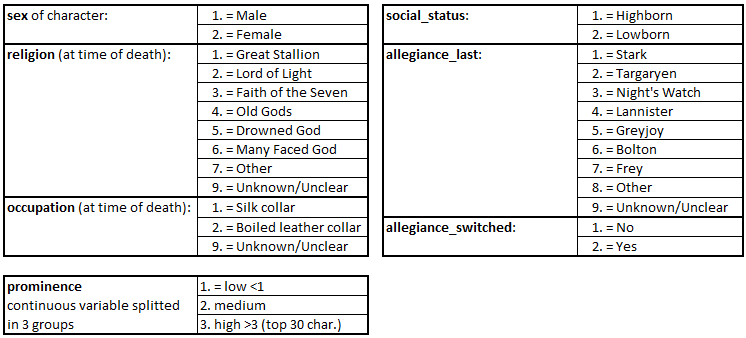

## Description

- Author: Anthony Jourdan
- Date: 5 april 2020


 

# <u>Objectives</u>

Target of this analysis is to study ...


# <u>Dataset description</u>

Dataset downloaded from [here](https://figshare.com/articles/Game_of_Thrones_mortality_and_survival_dataset/8259680/1)

Game of Thrones mortality and survival dataset

Dataset posted on 13.06.2019, 10:25 by Reidar Lystad Benjamin Brown

This dataset includes data from Game of Thrones Seasons 1–8. The dataset comprises two separate datasets and an accompanying data dictionary. The character dataset contains 359 observations (i.e. characters) and 35 variables, including information about sociodemographics, exposures, and mortality. The episode dataset contains 73 observations (i.e. episodes) and 8 variables, including information about episode running time.


In this study we will use only the character dataset.

### Character dataset

- Number of observations: 359.
- Outcome: 
  - **exp_time_hrs** Survival time of character (calculated as the time between first apparition and death)
- Censoring indicator: 
  - **dth_flag** = 0 if character is not dead by the end of the serie , = 1 otherwise
- Explanatory variables:


# <u>Data Preparation</u>

load needed libraries
```{r}
library(tidyverse)
library(survival)
library(ggfortify)
library(ggplot2)
library(broom)
library(survminer)
```

import datas from csv file:
```{r}
setwd("C:/MY_DATAS/MyGit/GoT-Survival_Analysis")
raw_data =  read.csv("./GoT_dataset/character_data_S01-S08.csv")
dat = select(raw_data,name,exp_time_hrs,dth_flag,sex,religion,occupation,social_status,allegiance_last,allegiance_switched,prominence)
dat = mutate(dat,
              sex = c("Male","Female")[match(sex, c(1,2))],
              religion = c("Great Stallion","Lord of Light","Faith of the Seven","Old Gods","Drowned God","Many Faced God","Other","Unknown/Unclear")[match(religion,c(1,2,3,4,5,6,7,9))],
              occupation = c("Silk collar","Boiled leather collar","Unknown/Unclear")[match(occupation,c(1,2,9))],
              social_status = c("Highborn","Lowborn")[match(social_status,c(1,2))],
              allegiance_last = c("Stark","Targaryen","Night's Watch","Lannister","Greyjoy","Bolton","Frey","Other","Unknown/Unclear")[match(allegiance_last,c(1,2,3,4,5,6,7,8,9))],
              allegiance_switched = c("No","Yes")[match(allegiance_switched,c(1,2))],
              prominence = ifelse(prominence>3,"High",ifelse(prominence<1,"Low","Medium"))
              )

```

# <u>Data Exploration</u>

Proportion of people dead before the end of the serie.
```{r}
prop.table(table(dat$dth_flag))
```
--> roughly 40% of censored datas, 60% of the characters in the study are dead before the end of the serie


Show explanatory variables composition:
```{r}

draw_pie_plot <- function(df,col){
  data = df %>% group_by(df[,col]) %>%
    count() %>%
    rename(group = names(.)[1]) %>%
    ungroup() %>% 
    mutate(per=`n`/sum(`n`)) %>%
    arrange(desc(group))
  
  data$label = scales::percent(data$per)

  options(repr.plot.width = 14, repr.plot.height = 8)
  
  ggplot(data=data)+
    geom_bar(aes(x="", y=per, fill=group), stat="identity", width = 1)+
    coord_polar("y", start=0)+
    theme_void()+
    geom_text(aes(x=1.3, y = cumsum(per) - per/2, label=label))+
    scale_fill_discrete(name = col)
}

```

```{r fig.height=10, fig.width=10}

d_plot = dat %>%
  select(-name,-exp_time_hrs,-dth_flag) %>%
  gather() %>%
  group_by(key) %>%
  count(value) %>% 
  mutate(frequency=round(`n`/sum(`n`)*100,0)) %>%
  arrange(desc(key),desc(frequency))

d_plot %>% ggplot(aes(x=value, y=frequency)) +
    facet_wrap(~ key, scales = "free") +
    geom_bar(stat="identity", fill="steelblue") +
    theme(axis.text.x = element_text(angle = 90, hjust = 1))
    
```


```{r,fig.height=3}
draw_pie_plot(dat,"sex")
draw_pie_plot(dat,"religion")
draw_pie_plot(dat,"occupation")
draw_pie_plot(dat,"social_status")
draw_pie_plot(dat,"allegiance_last")
draw_pie_plot(dat,"allegiance_switched")
draw_pie_plot(dat,"prominence")
```

--> 65% of the population have not known or unclear religion --> Careful to check if meaningful
--> most are Boiled leather collar
--> 70% are lowborn

# <u>Global survival overview</u>

**Kaplan-Meyer estimator**

- First look at outcome: 
```{r}
fit.KM = survfit(Surv(exp_time_hrs, dth_flag) ~ 1, data = dat)
autoplot(fit.KM,conf.int.fill = "#00FF00") + 
  geom_hline(yintercept=.5, linetype="dashed", color = "red") 


```

Median Survival Time: 28.8hrs
- As a character, you would have 50% of change to stay alive up to 28.8hrs

```{r}
fit.KM
```

# <u>Survival vs Explanatory variables</u>

Used functions
```{r}
plot_KM <- function(df,col,CI=TRUE){
  fit = survfit(Surv(df$exp_time_hrs, df$dth_flag) ~ df[,col])
  autoplot(fit,conf.int=CI,censor=FALSE) + 
    geom_hline(yintercept=.5, linetype="dashed", color = "red") 
}

print_medians <- function(df,col){
  fit = survfit(Surv(df$exp_time_hrs, df$dth_flag) ~ df[,col])
  infos_fit = surv_median(fit)
  infos_fit = infos_fit %>% 
    mutate(strata=substr(strata,11,100))
  cat("Medians:\n")
  cat(sprintf("%*s %*s %*s\n",25,"Group",15,"Median",20,"Conf.Interval"))
  fit.conf=paste("( ",infos_fit$lower,";",infos_fit$upper," )",sep="")
  cat(sprintf("%*s %*s %*s\n",25,infos_fit$strata,15,infos_fit$median,20,fit.conf))
}

print_cox <- function(df,col){
  fit_cox = coxph(Surv(df$exp_time_hrs, df$dth_flag) ~ df[,col])
  x = tidy(fit_cox)
  cox.ref = fit_cox$xlevels[[1]][1]
  cox.term = substr(x$term,10,100)
  cox.hr = round(exp(x$estimate),2)
  cox.hr.conflow = round(exp(x$conf.low),2)
  cox.hr.confhigh = round(exp(x$conf.high),2)
  cat("Cox Regression:\n")
  cat(sprintf("%*s %*s %*s\n",25,"Group",15,"Hazard Ratio",20,"Conf.Interval"))
  cat(sprintf("%*s %*s %*s\n",25,cox.ref,15,"(Reference)",20,"-"))
  cox.conf=paste("( ",cox.hr.conflow,";",cox.hr.confhigh," )",sep="")
  cat(sprintf("%*s %*s %*s\n",25,cox.term,15,cox.hr,20,cox.conf))
  y = glance(fit_cox)
  cox.lrt = ifelse(y$p.value.log<0.01,formatC(y$p.value.log, format = "e", digits = 2),formatC(y$p.value.log, digits = 2))
  cat(paste("\nLikelihood Ratio Test:",cox.lrt))
}

```

### - How is gender influencing survival time ?

```{r,fig.height=4,fig.width=7}
plot_KM(dat,"sex")
```

```{r}
print_cox(dat,"sex")
```

Likelihood ratio test (LRT) pvalue is very small, proving that there is a significant difference between male and female survival time.

 !!!! Hazard ration is 1.87, meaning that male have 1.87 more chances to be killes than women 

Here are the median survival time for each category:

```{r}
print_medians(dat,"sex")
```


### - How is religion survival time ?
    
```{r,fig.height=4,fig.width=7}
plot_KM(dat,"religion",FALSE)
``` 

```{r}
print_cox(dat,"religion")
```

Cox regression LRT pvalue is quite large and > 5% pointing that there is no significant difference between religions 

One thing that can be noted from the graph is that the "Drowned God" religion has a median survival time very low...

If you were of this religion, you would have only 50% chance to survive after 1.11hrs ! (pretty scary)

```{r}
print_medians(dat,"religion")
```


### - How is occupation influencing ?
    
```{r,fig.height=4,fig.width=7}
plot_KM(dat,"occupation")
``` 
    
```{r}
print_cox(dat,"occupation")
```

LRT pvalue is < 5%, we can say that at least one group is significantly different from other.
It's certainly due to the group 'Unknown/Unclear' which has an hazard ratio close to 0.5, the 2 others are very close (HR ~ 1).
this can be also seen on the medians were CI are overlapping.

```{r}
print_medians(dat,"occupation")
```


## --> Is social_status influencing ?
    
```{r,fig.height=4,fig.width=7}
plot_KM(dat,"social_status")
``` 
    
```{r}
print_cox(dat,"social_status")
```

Again LRT pvalue is <5%, meaning that to be highborn or lowborn is significantly differnt in terms of survival time in GoT.

```{r}
print_medians(dat,"social_status")
```

## --> Is the last allegiance made influencing ?
    
```{r,fig.height=4,fig.width=7}
plot_KM(dat,"allegiance_last",FALSE)
``` 
    
```{r}
print_cox(dat,"allegiance_last")
```

LRT pvalue is < 5%, we can say that at least one group is significantly different from other.

If you allegiance goes to 'Bolton', then you have 0% of chance to be present during all the show.
But if you follow the 'Greyjoy', the you're median survival time is only of 1.11hrs...

```{r}
print_medians(dat,"allegiance_last")
```


## --> Is the fact to have switched allegiance during the serie influencing ?
    
```{r,fig.height=4,fig.width=7}
plot_KM(dat,"allegiance_switched")
``` 
    
```{r}
print_cox(dat,"allegiance_switched")
```

pvalue < 5%, the change in allegiance has a real impact on the characters survival times.
it seems, that in GoT, if you want to maximize your chances to survive, you have to not be too strict with your allegiance.


```{r}
print_medians(dat,"allegiance_switched")
```


## --> Is prominence influencing ?
    
```{r,fig.height=4,fig.width=7}
plot_KM(dat,"prominence")
``` 
    
```{r}
print_cox(dat,"prominence")
```

Very significant difference, sounds logic for characters with high prominence (stars of the show), that producers decided no to kill them at the begining of the show so their survival time is higher than others.
It seems more surprising to me, that people with low prominence have a higher survival time than the ones in the middle.

```{r}
print_medians(dat,"prominence")
```

# <u>Build a model of Survival time in GoT</u>

```{r}
dat_model = select(dat,-name)
Model_Full = coxph(Surv(exp_time_hrs,dth_flag)~.,data=dat_model)
MAIC = step(Model_Full)
```

```{r}
MAIC
```


# <u>Predict from model for some characters and compare with observed datas</u>

```{r}
d_new = dat %>% 
  filter(name %in% c("Arya Stark","Jaime Lannister","Theon Greyjoy","Jon Snow","Eddard Stark","Ramsay Bolton","Samwell Tarly","Illyrio Mopatis","Mhaegen","Todder","Merry Frey")) %>% 
  select(-exp_time_hrs,-dth_flag)

z = list()

for(i in 1:nrow(d_new)) {
    row <- d_new[i,]
    p_s = survfit(MAIC,newdata = row)
    z = c(z,list(p_s))
}
names(z)=d_new$name

ggsurvplot_combine(z,
           conf.int = FALSE,
           risk.table = FALSE,
           pval = FALSE,
           censor = FALSE,
           surv.median.line = "hv",
           ggtheme = theme_gray())


```


