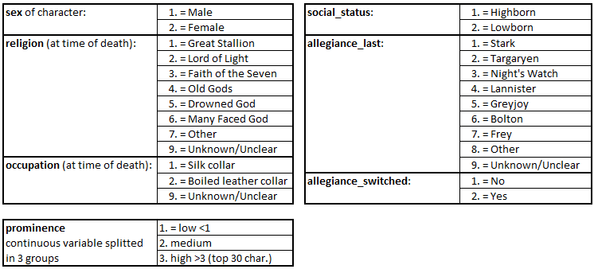
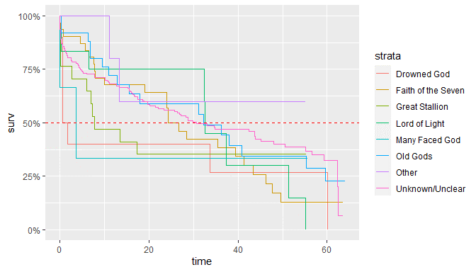

# GoT Survival Analysis


Description
-----------

-   Author: Anthony Jourdan
-   Date: 10 April 2020
-   Notebook available at:
    <https://github.com/terman37/GoT-Survival_Analysis>

Objectives
----------

Target of this study is to analyze how much time was spent on screen by characters of GoT before they died (or the show ends).

We will try to find most influencing criterions among social indicators, and build a survival model.

This model will then be evaluated and checked on a test dataset.

Dataset description
-------------------

### Dataset Information

Dataset downloaded from [here](https://figshare.com/articles/Game_of_Thrones_mortality_and_survival_dataset/8259680/1)

Game of Thrones mortality and survival dataset

Dataset posted on 13.06.2019, 10:25 by Reidar Lystad Benjamin Brown

This dataset includes data from Game of Thrones Seasons 1--8. The dataset comprises two separate datasets and an accompanying data dictionary. The character dataset contains 359 observations
(i.e. characters) and 35 variables, including information about sociodemographic, exposures, and mortality. The episode dataset contains 73 observations (i.e. episodes) and 8 variables, including information
about episode running time.

In this study we will use only the character dataset.

### Character dataset

-   Number of observations: 359.
-   Outcome: **exp\_time\_hrs** - On screen time before death = Survival time of character
    
    ​	(calculated as the time between first apparition and death)
    
- Censoring indicator: **dth\_flag**

  ​	= 0 if character is not dead by the end of the show, = 1 otherwise

- Explanatory variables:



Data Preparation
----------------

Load needed libraries

```R
library(tidyverse)
library(survival)
library(ggfortify)
library(ggplot2)
library(broom)
library(survminer)
library(survivalROC)
```

Import data from csv file and format output:

```R
raw_data = read.csv("./GoT_dataset/character_data_S01-S08.csv")
dat_full = raw_data %>% 
  select(name,
         exp_time_hrs,
         dth_flag,
         sex, religion,
         occupation, social_status,
         allegiance_last, allegiance_switched,
         prominence) %>% 
  mutate(sex = c("Male", "Female")[match(sex, c(1,2))],
         religion = c("Great Stallion",
                  "Lord of Light",
                  "Faith of the Seven",
                  "Old Gods",
                  "Drowned God",
                  "Many Faced God",
                  "Other",
                  "Unknown/Unclear")[match(religion,c(1,2,3,4,5,6,7,9))],
         occupation = c("Silk collar",
                    "Boiled leather collar",
                    "Unknown/Unclear")[match(occupation,c(1,2,9))],
         social_status = c("Highborn", "Lowborn")[match(social_status,c(1,2))],
         allegiance_last = c("Stark",
                         "Targaryen",
                         "Night's Watch",
                         "Lannister",
                         "Greyjoy",
                         "Bolton",
                         "Frey",
                         "Other",
                         "Unknown/Unclear")[match(allegiance_last,c(1,2,3,4,5,6,7,8,9))],
         allegiance_switched = c("No", "Yes")[match(allegiance_switched,c(1,2))],
         prominence = ifelse(prominence>3, "High",
                         ifelse(prominence<1, "Low", "Medium")
                         ))
```

Keep 15% of data for evaluating the final model

```R
train_size = 85 / 100 * nrow(dat_full)
idx.dat = sample.int(nrow(dat_full), size = train_size, replace = FALSE)
dat = dat_full[idx.dat,]
dat_test = dat_full[-idx.dat,]
```

Data Exploration
----------------

### Outcome: Survival duration

Let's have a look at basic statistics about the survival duration.

```R
summary(dat$exp_time_hrs)
##    Min. 1st Qu.  Median    Mean 3rd Qu.    Max. 
##    0.00    4.22   18.87   23.12   40.37   63.99
ggplot(dat,aes(exp_time_hrs)) + geom_histogram(bins = 10, color="black",fill="steelblue")
```

{width="5.0526312335958in"
height="2.021052055993001in"}

Median screen time for characters is almost 19 hours and 75% are not able to be on screen more than 40 hours, but it can be because they are dead or because the show has ended (careful with histograms and censored data)

### Censoring indicator

Proportion of people dead before the end of the show.

```R
prop.table(table(dat$dth_flag))
##         0         1 
## 0.4098361 0.5901639
```

Roughly 40% of data are censored, 60% of the characters in the study are dead before the end of the TV show.

### Explanatory variables

Show explanatory variables composition:

```R
d_plot = dat %>%
  select(-name,-exp_time_hrs,-dth_flag) %>%
  gather() %>%
  group_by(key) %>%
  count(value) %>% 
  mutate(frequency=round(`n`/sum(`n`)*100,0)) %>%
  arrange(desc(key),desc(frequency))

d_plot %>% ggplot(aes(x=value, y=frequency)) +
    facet_wrap(~ key, scales = "free") +
    geom_bar(stat="identity", fill="steelblue") +
    theme(axis.text.x = element_text(angle = 90, hjust = 1))
```

{width="7.235576334208224in"
height="7.402597331583552in"}

<u>Main things to have in mind during analysis:</u>

-   70% of characters are men, 30% are women.
-   70% are lowborn, 30% are high born, but we should see more survival in highborn (as they are less on the field during wars?)
-   Most are boiled leather collar (60%)
-   65% of the population have not known or unclear religion --\> Careful to check if meaningful
-   Main allegiance is for Stark Family, after the "other" category, no sure to know what is the difference with "unknown/unclear"
-   A vast majority of character have not switched allegiance during the show (does it help them to survive?)
-   We have a smaller high prominence category, which make sense as it represents top characters of the show, low and medium are quite balanced.

Global survival overview
------------------------

**Kaplan-Meyer estimator**

```R
fit.KM = survfit(Surv(exp_time_hrs, dth_flag) ~ 1, data = dat)
autoplot(fit.KM,conf.int.fill = "#00FF00", censor=FALSE) +
  geom_hline(yintercept=.5, linetype="dashed", color = "red") + 
  ggtitle("Kaplan-Meier estimate with CI")
```

{width="5.0526312335958in"
height="4.0421052055993in"}

Median Survival Time: 29.9hrs - As a character, you would have 50% of change to appear on screen up to 30hrs .

```R
fit.KM
## Call: survfit(formula = Surv(exp_time_hrs, dth_flag) ~ 1, data = dat)
## 
##       n  events  median 0.95LCL 0.95UCL 
##   305.0   181.0    29.9    24.0    38.0
```

Survival vs Explanatory variables
---------------------------------

### Used functions

```R
# draw the KM survival curve with stratification with a given exlanatory variable
plot_KM <- function(df,col,CI=TRUE){
  fit = survfit(Surv(df$exp_time_hrs, df$dth_flag) ~ df[,col])
  autoplot(fit,conf.int=CI,censor=FALSE) + 
    geom_hline(yintercept=.5, linetype="dashed", color = "red") 
}

# Print the medians for stratas (+formating)
print_medians <- function(df,col){
  fit = survfit(Surv(df$exp_time_hrs, df$dth_flag) ~ df[,col])
  infos_fit = surv_median(fit) %>%
    mutate(strata=substr(strata,11,100))
  cat("Medians:\n")
  cat(sprintf("%*s %*s %*s\n",25,"Group",15,"Median",20,"Conf.Interval"))
  fit.conf=paste("( ",infos_fit$lower,";",infos_fit$upper," )",sep="")
  cat(sprintf("%*s %*s %*s\n",25,infos_fit$strata,15,infos_fit$median,20,fit.conf))
}

# Print cox regression HR+CI and LRT for stratas (+formating)
print_cox <- function(df,col){
  fit_cox = coxph(Surv(df$exp_time_hrs, df$dth_flag) ~ df[,col])
  x = tidy(fit_cox)
  cox.ref = fit_cox$xlevels[[1]][1]
  cox.term = substr(x$term,10,100)
  cox.hr = round(exp(x$estimate),2)
  cox.hr.conflow = round(exp(x$conf.low),2)
  cox.hr.confhigh = round(exp(x$conf.high),2)
  cat("Cox Regression:\n")
  cat(sprintf("%*s %*s %*s\n",25,"Group",15,"Hazard Ratio",20,"Conf.Interval"))
  cat(sprintf("%*s %*s %*s\n",25,cox.ref,15,"(Reference)",20,"-"))
  cox.conf=paste("( ",cox.hr.conflow,";",cox.hr.confhigh," )",sep="")
  cat(sprintf("%*s %*s %*s\n",25,cox.term,15,cox.hr,20,cox.conf))
  y = glance(fit_cox)
  cox.lrt = ifelse(y$p.value.log<0.01,
                   formatC(y$p.value.log, format = "e", digits = 2),
                   formatC(y$p.value.log, digits = 2))
  cat(paste("\nLikelihood Ratio Test:",cox.lrt))
}
```

### How is gender influencing survival time?

------------------------------------------

```R
plot_KM(dat,"sex")
```

{width="5.833333333333333in"
height="3.3333333333333335in"}

```R
print_cox(dat,"sex")
## Cox Regression:
##                     Group    Hazard Ratio        Conf.Interval
##                    Female     (Reference)                    -
##                      Male            1.81         ( 1.26;2.6 )
## 
## Likelihood Ratio Test: 6.79e-04
```

Likelihood ratio test (LRT) pvalue is very small, proving that there is a significant difference between men and women survival time.

Hazard ration is 1.81, meaning that men have almost twice more chances to be killed than women

Here is the median survival time for each category:

```R
print_medians(dat,"sex")
## Medians:
##                     Group          Median        Conf.Interval
##                    Female           43.92         ( 34.57;NA )
##                      Male           24.34       ( 15.5;32.56 )
```

### How is religion survival time?

--------------------------------

```R
plot_KM(dat,"religion",FALSE)
```

{width="5.833333333333333in"
height="3.3333333333333335in"}

```R
print_cox(dat,"religion")
## Cox Regression:
##                      Group    Hazard Ratio        Conf.Interval
##                Drowned God     (Reference)                    -
##         Faith of the Seven             0.7        ( 0.32;1.57 )
##             Great Stallion            0.89        ( 0.36;2.21 )
##              Lord of Light            0.64        ( 0.24;1.71 )
##             Many Faced God            0.79        ( 0.17;3.71 )
##                   Old Gods            0.51        ( 0.22;1.18 )
##                      Other            0.33        ( 0.07;1.55 )
##            Unknown/Unclear            0.54        ( 0.26;1.11 )
## 
## Likelihood Ratio Test: 0.49
```

Cox regression LRT pvalue is very large and \> 5% pointing that there is no significant difference between religions.

One thing that can be noted from the graph is that the "Drowned God" religion has a median survival time very low... If you were of this religion, you would have only 50% chance stay on screen more than 1.1hrs! (pretty scary)

```R
print_medians(dat,"religion")
## Medians:
##                      Group          Median        Conf.Interval
##                Drowned God            1.11          ( 0.54;NA )
##         Faith of the Seven           24.34      ( 19.08;43.37 )
##             Great Stallion            7.77          ( 5.95;NA )
##              Lord of Light           32.56         ( 32.36;NA )
##             Many Faced God            3.59          ( 0.05;NA )
##                   Old Gods            32.3          ( 15.5;NA )
##                      Other              NA         ( 13.32;NA )
##            Unknown/Unclear            30.6      ( 22.14;47.99 )
```

### How is occupation influencing?

--------------------------------

```R
plot_KM(dat,"occupation")
```

{width="5.833333333333333in"
height="3.3333333333333335in"}

```R
print_cox(dat,"occupation")
## Cox Regression:
##                     Group    Hazard Ratio        Conf.Interval
##     Boiled leather collar     (Reference)                    -
##               Silk collar            0.93        ( 0.67;1.29 )
##           Unknown/Unclear            0.53        ( 0.28;0.98 )
## 
## Likelihood Ratio Test: 0.086
```

LRT pvalue is \> 5%, we can say that there is no significant difference between groups. Maybe the group 'Unknown/Unclear' is slightly different -- not significantly (10% of characters) with a hazard ratio close to
0.5, the 2 others are closer (HR \~ 1). This can be also seen on the medians were CI are overlapping.

```R
print_medians(dat,"occupation")
## Medians:
##                     Group          Median        Conf.Interval
##     Boiled leather collar           25.68       ( 15.9;40.81 )
##               Silk collar           32.56      ( 26.74;41.33 )
##           Unknown/Unclear              NA         ( 20.25;NA )
```

### Is social status influencing?

-------------------------------

```R
plot_KM(dat,"social_status")
```

{width="5.833333333333333in"
height="3.3333333333333335in"}

```R
print_cox(dat,"social_status")
## Cox Regression:
##                     Group    Hazard Ratio        Conf.Interval
##                  Highborn     (Reference)                    -
##                   Lowborn            1.51         ( 1.1;2.09 )
## 
## Likelihood Ratio Test: 0.01
```

Again, LRT pvalue is \<5%, meaning that to be highborn or lowborn is significantly different in terms of survival time in GoT. Lowborn have a much smaller median survival time (with 20 hours vs 41 for highborn) but probability to survive over 50 hours tends to be the same whatever the social status.

```R
print_medians(dat,"social_status")
## Medians:
##                     Group          Median        Conf.Interval
##                  Highborn           41.33      ( 32.56;55.09 )
##                   Lowborn           19.76      ( 15.57;33.06 )
```

### Is the last allegiance made influencing?

```R
plot_KM(dat,"allegiance_last",FALSE)
```

{width="5.833333333333333in"
height="3.3333333333333335in"}

```R
print_cox(dat,"allegiance_last")
## Cox Regression:
##                      Group    Hazard Ratio        Conf.Interval
##                     Bolton     (Reference)                    -
##                       Frey            0.17        ( 0.06;0.46 )
##                    Greyjoy            0.72        ( 0.28;1.85 )
##                  Lannister            0.56        ( 0.28;1.15 )
##              Night's Watch            0.39        ( 0.18;0.84 )
##                      Other            0.43        ( 0.23;0.82 )
##                      Stark            0.23        ( 0.11;0.48 )
##                  Targaryen            0.34        ( 0.15;0.77 )
##            Unknown/Unclear            0.19        ( 0.08;0.45 )
## 
## Likelihood Ratio Test: 9.61e-05
```

LRT pvalue is \< 5%, we can say that at least one group is significantly different from other.

If your allegiance goes to 'Bolton', then you have 0% of chance to be present during all the show. But if you follow the 'Greyjoy', then your median survival time is not much better with 1.1hrs

```R
print_medians(dat,"allegiance_last")
## Medians:
##                      Group          Median        Conf.Interval
##                     Bolton           10.89          ( 1.49;NA )
##                       Frey           43.67         ( 43.37;NA )
##                    Greyjoy            1.11          ( 0.54;NA )
##                  Lannister          17.075       ( 4.57;45.18 )
##              Night's Watch            30.6      ( 16.76;55.34 )
##                      Other           21.45      ( 12.92;39.49 )
##                      Stark           55.22         ( 24.34;NA )
##                  Targaryen            34.8         ( 13.47;NA )
##            Unknown/Unclear              NA            ( NA;NA )
```

### Is the fact to have switched allegiance during the show influencing?

```R
plot_KM(dat,"allegiance_switched")
```

{width="5.833333333333333in"
height="3.3333333333333335in"}

```R
print_cox(dat,"allegiance_switched")
## Cox Regression:
##                     Group    Hazard Ratio        Conf.Interval
##                        No     (Reference)                    -
##                       Yes            0.46          ( 0.3;0.7 )
## 
## Likelihood Ratio Test: 8.39e-05
```

pvalue \< 5%, the change in allegiance has a real impact on the characters survival times.

It seems, that in GoT, if you want to maximize your chances to survive, you have to not be too strict with your allegiance. But remember, in the data exploration, we have seen that only a minority (15%) have switched allegiance. Characters are mainly loyal to their Families but it doesn't make their life longer...

```R
print_medians(dat,"allegiance_switched")
## Medians:
##                     Group          Median        Conf.Interval
##                        No           23.96      ( 16.76;31.18 )
##                       Yes           55.22         ( 45.18;NA )
```

### How is prominence influencing?

```R
plot_KM(dat,"prominence")
```

{width="5.833333333333333in"
height="3.3333333333333335in"}

```R
print_cox(dat,"prominence")
## Cox Regression:
##                     Group    Hazard Ratio        Conf.Interval
##                      High     (Reference)                    -
##                       Low            1.94        ( 1.01;3.73 )
##                    Medium            6.89       ( 3.61;13.13 )
## 
## Likelihood Ratio Test: 3.68e-19
```

Very significant difference, sounds logic for characters with high prominence (stars of the show), that producers decided not to kill them at the beginning of the show so their survival time is higher than
others. It seems more surprising to me, that people with low prominence have a higher survival time than the ones in the middle.

```R
print_medians(dat,"prominence")
## Medians:
##                      Group          Median        Conf.Interval
##                       High           62.31         ( 59.54;NA )
##                        Low           55.34         ( 38.03;NA )
##                     Medium           10.05       ( 1.49;16.06 )
```

Build a model of Survival time in GoT
-------------------------------------

### Model selection

-----------------

Let's start with a full model (using all explanatory variables) and run a step-wise model selection based on AIC.

```R
dat_model = select(dat,-name)
Model_Full = coxph(Surv(exp_time_hrs,dth_flag)~., data=dat_model)
MAIC = step(Model_Full)
## Start:  AIC=1717.13
## Surv(exp_time_hrs, dth_flag) ~ sex + religion + occupation + 
##     social_status + allegiance_last + allegiance_switched + prominence
## 
##                       Df    AIC
## - religion             7 1711.8
## - occupation           2 1715.5
## <none>                   1717.1
## - allegiance_last      8 1717.7
## - social_status        1 1717.7
## - sex                  1 1722.7
## - allegiance_switched  1 1732.3
## - prominence           2 1797.4
## 
## Step:  AIC=1711.75
## Surv(exp_time_hrs, dth_flag) ~ sex + occupation + social_status + 
##     allegiance_last + allegiance_switched + prominence
## 
##                       Df    AIC
## - occupation           2 1709.6
## <none>                   1711.8
## - social_status        1 1712.3
## - allegiance_last      8 1713.9
## - sex                  1 1716.5
## - allegiance_switched  1 1725.4
## - prominence           2 1788.4
## 
## Step:  AIC=1709.56
## Surv(exp_time_hrs, dth_flag) ~ sex + social_status + allegiance_last + 
##     allegiance_switched + prominence
## 
##                       Df    AIC
## <none>                   1709.6
## - allegiance_last      8 1711.3
## - social_status        1 1711.7
## - sex                  1 1717.8
## - allegiance_switched  1 1723.6
## - prominence           2 1785.0
```

After the step-wise selection, it appears that religion and occupation can be removed from model.

Remember that there was not significant difference between religion and occupation with p-values above 5%.

### Model description & explanation

---------------------------------

What's the model looks like?

```R
MAIC
## Call:
## coxph(formula = Surv(exp_time_hrs, dth_flag) ~ sex + social_status + 
##     allegiance_last + allegiance_switched + prominence, data = dat_model)
## 
##                                   coef exp(coef) se(coef)      z        p
## sexMale                         0.5843    1.7938   0.1913  3.055  0.00225
## social_statusLowborn            0.3699    1.4476   0.1857  1.992  0.04641
## allegiance_lastFrey            -0.4090    0.6643   0.5630 -0.726  0.46754
## allegiance_lastGreyjoy          0.2553    1.2908   0.4970  0.514  0.60752
## allegiance_lastLannister       -0.2329    0.7922   0.3677 -0.633  0.52648
## allegiance_lastNight's Watch   -0.8932    0.4094   0.3956 -2.258  0.02397
## allegiance_lastOther           -0.3348    0.7155   0.3322 -1.008  0.31365
## allegiance_lastStark           -0.8634    0.4217   0.3942 -2.190  0.02850
## allegiance_lastTargaryen       -0.2821    0.7542   0.4295 -0.657  0.51125
## allegiance_lastUnknown/Unclear -1.0085    0.3648   0.4515 -2.234  0.02550
## allegiance_switchedYes         -0.8752    0.4168   0.2319 -3.775  0.00016
## prominenceLow                   0.1283    1.1369   0.3741  0.343  0.73160
## prominenceMedium                1.5629    4.7726   0.3510  4.453 8.48e-06
## 
## Likelihood ratio test=137.5  on 13 df, p=< 2.2e-16
## n= 305, number of events= 181
```

A more readable way to show model:

```R
ggforest(MAIC)
```

{width="5.480015310586177in"
height="5.155843175853018in"}

Most important things to note from model:

-   men are 1.8 times more likely to be killed than women.

-   lowborn are 1.4 times more likely to be killed than highborn.

-   all allegiance (except to Greyjoy) are better for your chances of survival than the Bolton's one. Best one which be the allegiance to 'Stark' or 'lastNight\'s Watch' family
    
-   Switch allegiance gives 2.4 times more chances of survival

-   Characters with medium prominence are 4.5 times more likely to not survive than high prominence.

Concordance index shows quite good result with 77% of survival times correctly ordered by the model

Evaluating and checking model
-----------------------------

### ROC curve charts

Look at the ROC curves on test set for predicting survival at time t (hours):

```R
lp = predict(MAIC, newdata = dat_test, type="lp")
ROC_func <- function(t){
  res = survivalROC(Stime = dat_test$exp_time_hrs,
            status = dat_test$dth_flag,
            marker = lp,
            predict.time = t,
            method = "KM")
  with(res, plot(TP ~ FP, type = "l", main = sprintf("t = %.0f, AUC = %.2f", t, AUC)))
  abline(a = 0, b = 1, lty = 2)
  res
}
layout(matrix(1:6, byrow = TRUE, ncol = 3))
res.survivalROC.age.sex <- lapply(1:6 * 10, function(t) {
    ROC_func(t)
})
```

{width="5.664501312335958in"
height="3.1428576115485565in"}

From the ROC curves and AUC scores we can see that predictions on test set are pretty stable for estimation to survive for 10,20,30,40,50,60 hours (AUC \~ 0.7). the model predicting power is better for predicting survival at 50 hours (AUC = 0.85)

### Case deletion residuals:

```R
dfbetas = residuals(MAIC, type='dfbetas')
db = sqrt(rowSums(dfbetas^2))
plot(db,type = 'h')
abline(h=0)
```

{width="4.675324803149606in"
height="2.4415583989501313in"}

One case seems to have a larger impact on final estimates, let's find who it is:

```R
idx=names(db[db>1])
dat[idx,]
```


```R
dat_new = dat[idx,]
z = list()
for(i in 1:nrow(dat_new)) {
    row <- dat_new[i,]
    p_s = survfit(MAIC,newdata = row)
    z = c(z,list(p_s))
}
names(z)=dat_new$name
ggsurvplot_combine(z, censor = FALSE, ggtheme = theme_gray(), legend="right")
```

{width="4.73125in" height="2in"}

As we can see, Ramsay Bolton seems to be an exception to survival predictions. If we look at prediction curve based on model it seems that is chance to survive 31.18 hours (as observed) is extremely low, but indeed he did it. If there is no mistake in observed data, model could be improved by removing this one from dataset.

Conclusions
-----------

Using Survival Analysis techniques, we have been able to describe what are the criterions that are the most influencing survival time of characters in Game of Thrones.

We also have built a model to predict survival time for characters in the test set (never seen before), even if this may not be so useful now that the tv show has ended... maybe for season 9 someday.

As a final result we can say that chances of survival for a character were better if you were:

-   A woman

-   Highborn

-   Being loyal to 'Stark' or 'Night\'s Watch' family by the end of the
    show

-   But not too loyal... it's better if you have switched allegiance

-   And of course, with high prominence (star of the show)

Let's see who is corresponding:

```R
dat_full %>% filter(sex == "Female" & 
                    social_status=="Highborn" & 
                    (allegiance_last=="Stark" | allegiance_last=="Night's Watch" ) &
                    allegiance_switched=="Yes" &
                    prominence=="High")
```

{width="7.5625in" height="0.7722222222222223in"}

As we can see these 3 characters have not been killed during the show, the 2 first ones have been onscreen during all the duration of the show.

And the worst characteristics (in term of survival) are:

-   A man

-   Lowborn

-   Being loyal to 'Greyjoy' (or 'Bolton') family from the beginning
    till the end of the show

-   And with medium prominence

Let's see who is corresponding:

```R
dat_full %>% filter(sex == "Male" & 
                    social_status=="Lowborn" & 
                    (allegiance_last=="Greyjoy" | allegiance_last=="Bolton" ) &
                    allegiance_switched=="No" &
                    prominence=="Medium")
```

{width="7.337661854768154in"
height="1.9486242344706912in"}

Here we find again our exception 'Ramsay Bolton' which has a quite high survival time.

<u>Comments:</u> This study is of course subject to quality of the dataset, but as an exercise it was good enough to make some assumptions. Also, study could be continued as some fields of the dataset on how the death happened were not taken into account.